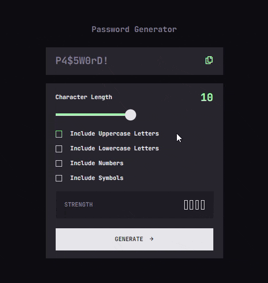

# Frontend Mentor - Password generator app solution

This is a solution to the [Password generator app challenge on Frontend Mentor](https://www.frontendmentor.io/challenges/password-generator-app-Mr8CLycqjh).

## Table of contents

- [Overview](#overview)
  - [The challenge](#the-challenge)
  - [Screenshot](#screenshot)
  - [Links](#links)
- [Built with](#built-with)
- [Author](#author)

## Overview

### The challenge

Users should be able to:

- Generate a password based on the selected inclusion options
- Copy the generated password to the computer's clipboard
- See a strength rating for their generated password
- View the optimal layout for the interface depending on their device's screen size
- See hover and focus states for all interactive elements on the page

### Screenshot

### Links

- Solution URL: [Code on GitHub](https://github.com/DmitryMuzalev/password-generator-app)
- Live Site URL: [Live on GitHub Pages](https://dmitrymuzalev.github.io/password-generator-app/)

## Built with

- React 18
- Flexbox
- SCSS

## Author

- Github - [DmitryMuzalev](https://github.com/DmitryMuzalev)
